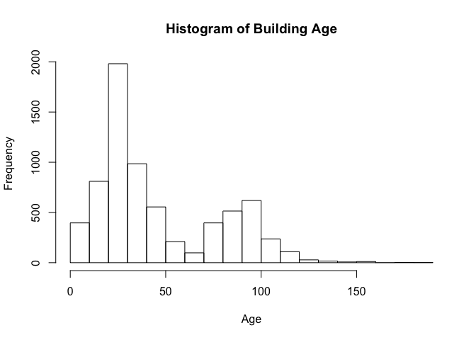
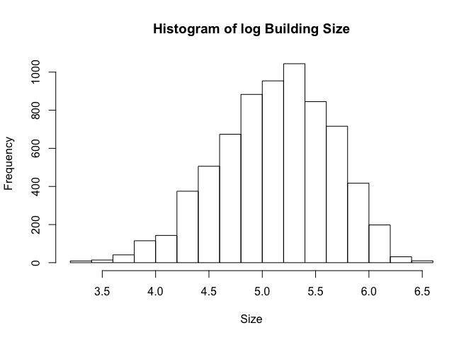

Green Buildings
================
Apoorv Mehrotra
8/23/2019

# The case

Over the past decade, both investors and the general public have paid
increasingly close attention to the benefits of environmentally
conscious buildings. There are both ethical and economic forces at work
here. In commercial real estate, issues of eco-friendliness are
intimately tied up with ordinary decisions about how to allocate
capital. In this context, the decision to invest in eco-friendly
buildings could pay off in at least four ways.

1.  Every building has the obvious list of recurring costs: water,
    climate control, lighting, waste disposal, and so forth. Almost by
    definition, these costs are lower in green buildings.  
2.  Green buildings are often associated with better indoor
    environments—the kind that are full of sunlight, natural
    materials, and various other humane touches. Such environments, in
    turn, might result in higher employee productivity and lower
    absenteeism, and might therefore be more coveted by potential
    tenants. The financial impact of this factor, however, is rather
    hard to quantify ex ante; you cannot simply ask an engineer in the
    same way that you could ask a question such as, “How much are these
    solar panels likely to save on the power bill?”  
3.  Green buildings make for good PR. They send a signal about social
    responsibility and ecological awareness, and might therefore command
    a premium from potential tenants who want their customers to
    associate them with these values. It is widely believed that a good
    corporate image may enable a firm to charge premium prices, to hire
    better talent, and to attract socially conscious investors.  
4.  Finally, sustainable buildings might have longer economically
    valuable lives. For one thing, they are expected to last longer, in
    a direct physical sense. (One of the core concepts of the
    green-building movement is “life-cycle analysis,” which accounts for
    the high front-end environmental impact of acquiring materials and
    constructing a new building in the first place.) Moreover, green
    buildings may also be less susceptible to market risk—in particular,
    the risk that energy prices will spike, driving away tenants into
    the arms of bolder, greener investors.

Of course, much of this is mere conjecture. At the end of the day,
tenants may or may not be willing to pay a premium for rental space in
green buildings. We can only find out by carefully examining data on the
commercial real-estate market.

We have data on 7,894 commercial rental properties from across the
United States. Of these, 685 properties have been awarded either LEED or
EnergyStar certification as a green building.

-----

     

# The goal

An Austin real-estate developer is interested in the possible economic
impact of “going green” in her latest project: a new 15-story mixed-use
building on East Cesar Chavez, just across I-35 from downtown. **Will
investing in a green building be worth it, from an economic perspective?
The baseline construction costs are $100 million, with a 5% expected
premium for green certification.**

## Initial recommendation

The developer has had someone on her staff, who’s been described to her
as a “total Excel guru from his undergrad statistics course,” run some
numbers on this data set and make a preliminary recommendation. Here’s
how this person described his process.

> I began by cleaning the data a little bit. In particular, I noticed
> that a handful of the buildings in the data set had very low occupancy
> rates (less than 10% of available space occupied). I decided to remove
> these buildings from consideration, on the theory that these buildings
> might have something weird going on with them, and could potentially
> distort the analysis. Once I scrubbed these low-occupancy buildings
> from the data set, I looked at the green buildings and non-green
> buildings separately. The median market rent in the non-green
> buildings was $25 per square foot per year, while the median market
> rent in the green buildings was $27.60 per square foot per year: about
> $2.60 more per square foot. (I used the median rather than the mean,
> because there were still some outliers in the data, and the median is
> a lot more robust to outliers.) Because our building would be 250,000
> square feet, this would translate into an additional $250000 x 2.6 =
> $650000 of extra revenue per year if we build the green building.

> Our expected baseline construction costs are $100 million, with a 5%
> expected premium for green certification. Thus we should expect to
> spend an extra $5 million on the green building. Based on the extra
> revenue we would make, we would recuperate these costs in
> $5000000/650000 = 7.7 years. Even if our occupancy rate were only 90%,
> we would still recuperate the costs in a little over 8 years. Thus
> from year 9 onwards, we would be making an extra $650,000 per year in
> profit. Since the building will be earning rents for 30 years or more,
> it seems like a good financial move to build the green building.

## Task at hand

The developer listened to this recommendation, understood the analysis,
and still felt unconvinced. She has therefore asked you to revisit the
report, so that she can get a second opinion. Based on your analysis of
the situation, make a recommendation to the developer.

-----

# Approach

After going through our excel guru’s analysis of the situation, we felt
that some important details were overlooked. We will look through those
missing details and some more as we go ahead with our analysis. Once we
determine the effect of the factors that are unaccounted for in the
analysis, we can give an unbiased opinion, solely based on the data

## Possible considerations

1.  Outliers were removed based on intuition and not solid numbers
2.  Occupancy as a dependant - Avg. occupancy rate assumed to be
    100%/90% throughout the 8/9 year period (if changed, will affect
    investment recovery time)
3.  Avg. rent calculation - rent can be calculated for smaller, more
    specific sections of the building population (by amenities,
    renovated, rating etc.).

### 1\. EDA before outlier removal

While the ability of these buildings to distort the analysis is real,
there was no mention of an EDA for these buildings or any outliers.
Let’s just confirm if the intuition is right.

Upon checking the distribution of data in the different bins of leasing
rate, we find that data is sparsely present for rates upto 60%. In the
graph below, we can clearly see that majority of the buildings are on
the higher side of the spectrum.

| Occupancy | Percent\_Data |
| --------: | ------------: |
|        10 |      2.723587 |
|        20 |      3.103623 |
|        30 |      4.294401 |
|        40 |      5.776539 |
|        50 |      8.652141 |
|        60 |     11.641753 |
|        70 |     17.798328 |
|        80 |     27.514568 |
|        90 |     50.975424 |
|       100 |    100.000000 |

Since the dataset does not mention the class and amenities of the new
building, for simplicity of computation we assume that our building will
belong to class a, have amenities=1, rent as net=0 (Since green
buildings can lower costs, this can be a potential addition to the
income stream)

Further looking at how many class c buildings are present in different
data sections,

<!-- -->

After some eyeballing on the summary statistics, we can say the
following about buildings with less than 60% occupancy(set60):

1.  These are smaller buildings, with lesser floors on an average.
2.  These builduings are generally older - their mean and median age are
    much above those of the mean and median of the population, even
    though the max(population)\>max(set60)
3.  30% of these buildings belong to class c as compared to 14% in the
    overall population
4.  2% of set60 buildings are green rated vs. almost 10% of population
5.  Majority((70%) of these buildings do not have amenities

Based on our assumptions and observations, we extend the outlier removal
to buildings with less than 60% occupancy.

### 2\. What all affects occupancy?

One big underlying assumption behind the prediction of the ~8yr time
frame for recovering the premium amount is that the building operates at
a 90% if not 100% occupancy from day 1. We will run a linear model to
find the factors that significantly affect our occupancy rate.

From our model, we found that out of the significant ones, the positive
are:

1.  Size
2.  Rent/sq.ft. / Cluster Rent
3.  Class a/b
4.  net
5.  Gas costs

The ones that affect occupancy negatively are:

1.  Employement Growth Rate
2.  Age of the building
3.  Having net contracts
4.  Precipitation
5.  Electricity costs

Since we do not have exact numbers for these factors for our building,
we will assume our rent to be 90% as a safer bet than a complete 100%.

### 3\. Average rent for specific building types

After observing the distribution of the variables, we will assign
buckets for different variables to our data based and couple data points
to compare similar buildings for rent as time progresses.

<!-- -->

<!-- -->

We grouped our data into segments, and based on those our building lies
in the following group:

1.  Amenities = 1 (Assumption)
2.  net = 0 (Assumption)
3.  Class = a (assumption)
4.  Size = Between 100k and 500k (Given as 250k)
5.  Age = Less than 20 years (new building)

And we will compare green vs. non-green average rents for this cut of
the data. Since we do not have any information about the cluster that
this building will lie in, we rely on the randomness of the data to give
an answer close to real.

| green\_rating | LEED | class\_a |     mean |       sd |
| :------------ | :--- | :------- | -------: | -------: |
| 0             | 0    | 1        | 36.39089 | 12.24439 |
| 1             | 0    | 1        | 34.09885 | 13.23243 |
| 1             | 1    | 1        | 34.93200 | 21.58111 |

We can observe from the computations above that the mean rent for green
buildings of class a is lesser than the mean rent for non-green
buildings of class a. Same is the case with the median. What’s more is
that the standard deviation is higher for green buildings, making the
investment riskier in short term.

If we go ahead and observe this for older buildings:

| green\_rating | LEED | class\_a |     mean |       sd |
| :------------ | :--- | :------- | -------: | -------: |
| 0             | 0    | 1        | 32.59567 | 12.70760 |
| 1             | 0    | 1        | 32.01176 | 12.81916 |
| 1             | 1    | 1        | 24.00000 |  0.00000 |

Slightly longer term projections of rent from the given data for
comparable (green) buildings in size bucket and amenities are much
lesser than those for non-green buildings.

-----

# Conclusion

Solely based on the data, our suggestion is against the green building
for now. If we are able to obtain some more data and information about
the location of the clusters and the building in questions, we might be
able to further refine the analysis to revise the answer. While from an
environmental point of view, a green building sounds sustainable,
future-proof and a PR generating asset, we are **unable to monetise the
effects of electricity costs, PR costs and returns, CSR costs and
returns etc on our building with this data.** With this kind of a
situation and uncertainty due to lack of data on a lot of the important
variables that can tell a better story, our recommendation is not to
invest an extra $5 Million as there is no guarantee of any extra
returns.

-----

# Appendix

## Data description

A group of real estate economists constructed the data in the following
way. Of the 1,360 green-certified buildings listed as of December 2007
on the LEED or EnergyStar websites, current information about building
characteristics and monthly rents were available for 685 of them. In
order to provide a control population, each of these 685 buildings was
matched to a cluster of nearby commercial buildings in the CoStar
database. Each small cluster contains one green-certified building, and
all non-rated buildings within a quarter-mile radius of the certified
building. On average, each of the 685 clusters contains roughly 12
buildings, for a total of 7,894 data points.

The columns of the data set are coded as follows:

  - CS.PropertyID: the building’s unique identifier in the CoStar
    database.  
  - cluster: an identifier for the building cluster, with each cluster
    containing one green-certified building and at least one other
    non-green-certified building within a quarter-mile radius of the
    cluster center.  
  - size: the total square footage of available rental space in the
    building.  
  - empl.gr: the year-on-year growth rate in employment in the
    building’s geographic region.  
  - Rent: the rent charged to tenants in the building, in dollars per
    square foot per calendar year.  
  - leasing.rate: a measure of occupancy; the fraction of the building’s
    available space currently under lease.  
  - stories: the height of the building in stories.  
  - age: the age of the building in years.  
  - renovated: whether the building has undergone substantial
    renovations during its lifetime.  
  - class.a, class.b: indicators for two classes of building quality
    (the third is Class C). These are relative classifications within a
    specific market. Class A buildings are generally the highest-quality
    properties in a given market. Class B buildings are a notch down,
    but still of reasonable quality. Class C buildings are the least
    desirable properties in a given market.  
  - green.rating: an indicator for whether the building is either LEED-
    or EnergyStar-certified.  
  - LEED, Energystar: indicators for the two specific kinds of green
    certifications.  
  - net: an indicator as to whether the rent is quoted on a \`\`net
    contract’’ basis. Tenants with net-rental contracts pay their own
    utility costs, which are otherwise included in the quoted rental
    price.  
  - amenities: an indicator of whether at least one of the following
    amenities is available on-site: bank, convenience store, dry
    cleaner, restaurant, retail shops, fitness center.  
  - cd.total.07: number of cooling degree days in the building’s region
    in 2007. A degree day is a measure of demand for energy; higher
    values mean greater demand. Cooling degree days are measured
    relative to a baseline outdoor temperature, below which a building
    needs no cooling.  
  - hd.total07: number of heating degree days in the building’s region
    in 2007. Heating degree days are also measured relative to a
    baseline outdoor temperature, above which a building needs no
    heating.  
  - total.dd.07: the total number of degree days (either heating or
    cooling) in the building’s region in 2007.  
  - Precipitation: annual precipitation in inches in the building’s
    geographic region.
  - Gas.Costs: a measure of how much natural gas costs in the building’s
    geographic region.  
  - Electricity.Costs: a measure of how much electricity costs in the
    building’s geographic region.  
  - cluster.rent: a measure of average rent per square-foot per calendar
    year in the building’s local market.
